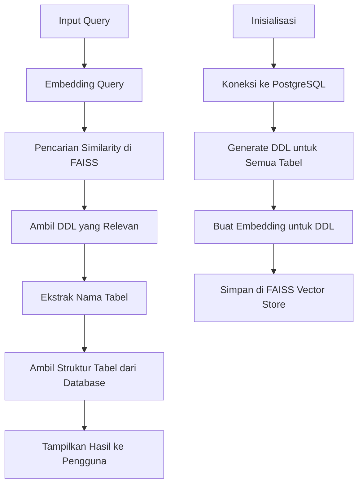
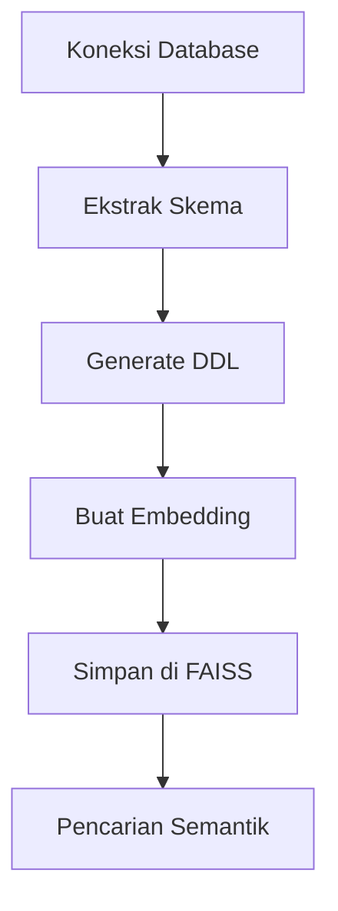
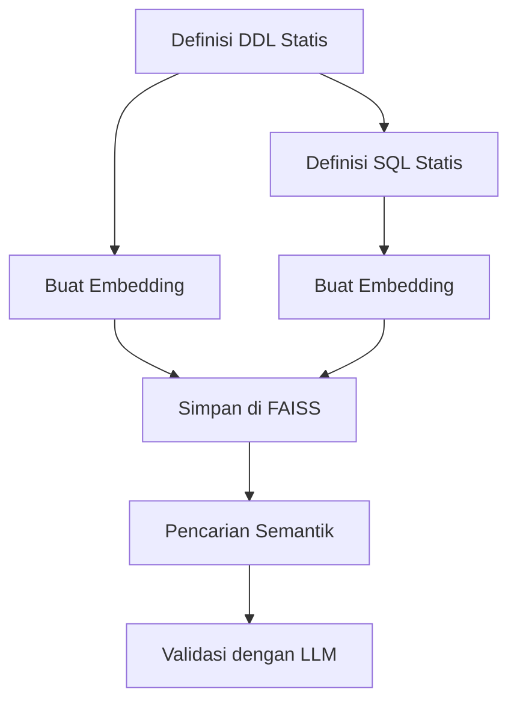

# FAISS-PostgreSQL

Sistem pencarian semantik untuk skema database PostgreSQL menggunakan FAISS (Facebook AI Similarity Search) dan embedding AI.

## Daftar Isi

- [Fitur Utama](#fitur-utama)
- [Arsitektur Sistem](#arsitektur-sistem)
- [Pendekatan Implementasi](#pendekatan-implementasi)
  - [Pendekatan Auto-Generate DDL](#pendekatan-auto-generate-ddl)
  - [Pendekatan Manual DDL](#pendekatan-manual-ddl)
  - [Perbandingan Pendekatan](#perbandingan-pendekatan)
- [Prasyarat](#prasyarat)
- [Instalasi](#instalasi)
- [Penggunaan](#penggunaan)
  - [Pendekatan Auto-Generate](#pendekatan-auto-generate)
  - [Pendekatan Manual](#pendekatan-manual)
- [Struktur Proyek](#struktur-proyek)
- [Pengembangan Lebih Lanjut](#pengembangan-lebih-lanjut)
- [Kontribusi](#kontribusi)
- [Lisensi](#lisensi)


## Fitur Utama

- **Ekstraksi Skema Database Otomatis**: Mengambil struktur tabel, kolom, tipe data, kunci primer, dan kunci asing dari database PostgreSQL
- **Pembuatan DDL untuk Semua Tabel**: Menghasilkan pernyataan DDL (Data Definition Language) untuk semua tabel dalam skema
- **Pencarian Semantik Menggunakan FAISS**: Menemukan skema database yang relevan berdasarkan query bahasa alami
- **Antarmuka Chat Sederhana**: Berinteraksi dengan sistem menggunakan antarmuka berbasis teks
- **Validasi dan Penjelasan Query SQL**: Memvalidasi dan menjelaskan query SQL yang ditemukan (khusus pendekatan manual)

## Arsitektur Sistem

Berikut adalah diagram alur kerja aplikasi:



### Komponen Utama

1. **Koneksi PostgreSQL**: Menghubungkan ke database PostgreSQL untuk mengakses metadata skema
2. **Ekstraksi Skema Database**: Mengambil informasi tentang tabel, kolom, dan relasi dari database
3. **Pembuatan Embedding dengan Google AI**: Mengkonversi teks DDL dan query menjadi vektor embedding
4. **Penyimpanan Vektor dengan FAISS**: Menyimpan dan mengindeks vektor embedding untuk pencarian cepat
5. **Pencarian Kesamaan**: Menemukan DDL yang paling mirip secara semantik dengan query pengguna
6. **Antarmuka Pengguna**: Menyediakan antarmuka chat sederhana untuk interaksi dengan sistem

## Pendekatan Implementasi

Proyek ini menyediakan dua pendekatan implementasi yang berbeda:

### Pendekatan Auto-Generate DDL

Pendekatan ini mengekstrak skema database secara langsung dari database PostgreSQL yang berjalan.



**Kelebihan**:
- Otomatis mengekstrak skema database terbaru
- Selalu up-to-date dengan perubahan skema database
- Mendukung ekstraksi relasi antar tabel (foreign keys)

**Komponen Utama**:
- `generate_ddl.py`: Berisi fungsi untuk menghasilkan pernyataan DDL dari database PostgreSQL
- `faiss_vector.py`: Mengatur penyimpanan vektor FAISS dengan embedding Google AI
- `main.py`: Menangani input pengguna dan menampilkan hasil

### Pendekatan Manual DDL

Pendekatan ini menggunakan DDL dan SQL yang telah didefinisikan sebelumnya dalam kode.



**Kelebihan**:
- Tidak memerlukan koneksi database langsung
- Dapat dikustomisasi untuk kasus penggunaan spesifik
- Mendukung validasi dan penjelasan query SQL dengan LLM

**Komponen Utama**:
- `documents_ddl.py`: Berisi definisi DDL statis untuk tabel-tabel
- `documents_sql.py`: Berisi kumpulan query SQL untuk berbagai pertanyaan
- `main.py`: Menangani input pengguna dan menampilkan hasil

### Perbandingan Pendekatan

| Fitur | Auto-Generate DDL | Manual DDL |
|-------|-------------------|------------|
| Koneksi database | Diperlukan | Tidak diperlukan |
| Up-to-date dengan skema | Ya, otomatis | Tidak, perlu diperbarui manual |
| Kustomisasi | Terbatas | Tinggi |
| Validasi query SQL | Tidak | Ya, dengan LLM |
| Penjelasan query | Tidak | Ya, dengan LLM |
| Kompleksitas setup | Lebih tinggi | Lebih rendah |

**Rekomendasi Penggunaan**:
- Gunakan **Pendekatan Auto-Generate** jika:
  - Anda memiliki akses langsung ke database PostgreSQL
  - Skema database sering berubah
  - Anda membutuhkan informasi skema yang selalu up-to-date

- Gunakan **Pendekatan Manual** jika:
  - Anda tidak memiliki akses langsung ke database
  - Skema database relatif stabil
  - Anda ingin menyesuaikan DDL dan query SQL untuk kasus penggunaan spesifik
  - Anda membutuhkan validasi dan penjelasan query SQL

## Prasyarat

### Untuk Kedua Pendekatan
- Python 3.8 atau lebih tinggi
- Akses ke Google AI API (untuk embedding)

### Khusus Pendekatan Auto-Generate
- PostgreSQL
- Akses ke database PostgreSQL yang ingin dicari

## Instalasi

1. Clone repository ini:
   ```bash
   git clone https://github.com/anandarh/faiss-sql.git
   cd faiss-sql
   ```

2. Buat virtual environment:
   ```bash
   python -m venv myenv
   ```

3. Aktifkan virtual environment:
   - Di Windows:
     ```bash
     myenv\Scripts\activate
     ```
   - Di macOS/Linux:
     ```bash
     source myenv/bin/activate
     ```

4. Instal dependensi:
   ```bash
   pip install -r requirements.txt
   ```

5. Buat file `.env` di direktori root proyek:
   ```
   POSTGRES_HOST=localhost
   POSTGRES_USER=username
   POSTGRES_PASSWORD=password
   POSTGRES_DB=database_name
   GOOGLE_API_KEY=your_google_api_key
   ```

6. Ganti nilai-nilai di atas dengan informasi koneksi PostgreSQL Anda dan kunci API Google AI Anda.

## Penggunaan

### Pendekatan Auto-Generate

1. Pastikan database PostgreSQL Anda berjalan dan berisi tabel-tabel yang ingin Anda cari.

2. Jalankan aplikasi:
   ```bash
   cd example_auto_generate_ddl
   python main.py
   ```

3. Aplikasi akan terhubung ke database, mengekstrak skema, dan membangun indeks FAISS.

4. Setelah inisialisasi selesai, Anda dapat memasukkan query dalam bahasa alami:
   ```
   User: Saya ingin tahu jumlah balita stunting di jawa barat
   ```

5. Sistem akan mengembalikan informasi skema yang relevan, termasuk struktur tabel, kolom, dan relasi.

6. Untuk keluar dari aplikasi, ketik:
   ```
   User: exit
   ```

### Pendekatan Manual

1. Jalankan aplikasi:
   ```bash
   cd example_manual_generate_ddl
   python main.py
   ```

2. Setelah aplikasi berjalan, Anda dapat memasukkan pertanyaan dalam bahasa alami:
   ```
   User: Berapa jumlah balita stunting di Jawa Barat?
   ```

3. Sistem akan:
   - Mencari query SQL yang paling relevan dengan pertanyaan Anda
   - Memvalidasi apakah query tersebut dapat menjawab pertanyaan Anda
   - Menjelaskan cara kerja query dan data yang akan dihasilkan

4. Ketik "exit" untuk keluar dari aplikasi.

## Struktur Proyek

```
faiss-postgresql/
├── example_auto_generate_ddl/
│   ├── faiss_vector.py     # Mengatur penyimpanan vektor FAISS
│   ├── generate_ddl.py     # Fungsi untuk menghasilkan DDL
│   ├── main.py             # File utama untuk pendekatan auto-generate
│   ├── requirements.txt    # Dependensi untuk pendekatan auto-generate
│   └── README.md           # Dokumentasi pendekatan auto-generate
├── example_manual_generate_ddl/
│   ├── documents_ddl.py    # Definisi DDL statis
│   ├── documents_sql.py    # Kumpulan query SQL
│   ├── main.py             # File utama untuk pendekatan manual
│   ├── requirements.txt    # Dependensi untuk pendekatan manual
│   └── README.md           # Dokumentasi pendekatan manual
└── README.md               # Dokumentasi utama proyek
```

### Fungsi Utama

#### Pendekatan Auto-Generate
- `generate_create_table_ddl()`: Menghasilkan pernyataan CREATE TABLE untuk tabel tertentu
- `generate_all_tables_ddl()`: Menghasilkan DDL untuk semua tabel dalam skema
- `call_similarity()`: Melakukan pencarian kesamaan menggunakan FAISS
- `get_table_structure()`: Mendapatkan struktur tabel dari database
- `main()`: Fungsi utama yang menangani input pengguna dan menampilkan hasil

#### Pendekatan Manual
- `call_similarity()`: Melakukan pencarian kesamaan menggunakan FAISS dan memvalidasi hasil dengan LLM

