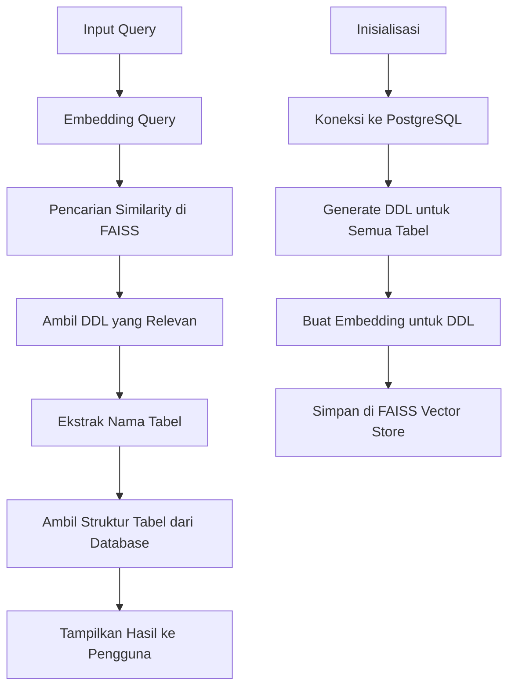

# FAISS-PostgreSQL

Alat untuk melakukan pencarian semantik pada skema database PostgreSQL menggunakan FAISS (Facebook AI Similarity Search) dan embedding AI.

## Daftar Isi

- [Latar Belakang](#latar-belakang)
- [Fitur](#fitur)
- [Prasyarat](#prasyarat)
- [Instalasi](#instalasi)
- [Konfigurasi](#konfigurasi)
- [Penggunaan](#penggunaan)
- [Struktur Proyek](#struktur-proyek)
- [Cara Kerja](#cara-kerja)
- [Kontribusi](#kontribusi)
- [Lisensi](#lisensi)

## Latar Belakang

Proyek ini dikembangkan untuk mengatasi kesulitan dalam mencari informasi skema database menggunakan bahasa alami. Saat bekerja dengan database yang kompleks, seringkali sulit untuk menemukan tabel atau kolom tertentu yang relevan dengan kebutuhan bisnis atau query yang ingin dibuat.

FAISS (Facebook AI Similarity Search) dan PostgreSQL adalah kombinasi yang ideal untuk mengatasi masalah ini:
- PostgreSQL menyediakan sistem database relasional yang kuat dengan metadata skema yang terstruktur
- FAISS menyediakan pencarian vektor yang cepat dan efisien untuk menemukan kesamaan semantik
- Google AI Embeddings memungkinkan konversi teks (DDL dan query) menjadi representasi vektor yang dapat dibandingkan secara semantik

## Fitur

- **Ekstraksi Skema Database Otomatis**: Mengambil struktur tabel, kolom, tipe data, kunci primer, dan kunci asing dari database PostgreSQL
- **Pembuatan DDL untuk Semua Tabel**: Menghasilkan pernyataan DDL (Data Definition Language) untuk semua tabel dalam skema
- **Pencarian Semantik Menggunakan FAISS**: Menemukan skema database yang relevan berdasarkan query bahasa alami
- **Antarmuka Chat Sederhana**: Berinteraksi dengan sistem menggunakan antarmuka berbasis teks

## Prasyarat

- Python 3.8 atau lebih tinggi
- PostgreSQL
- Akses ke Google AI API (untuk embedding)

## Instalasi

1. Clone repository ini:
   ```bash
   git clone https://github.com/username/faiss-pgsql.git
   cd faiss-pgsql
   ```

2. Buat virtual environment:
   ```bash
   python -m venv myenv
   ```

3. Aktifkan virtual environment:
   - Di Windows:
     ```bash
     myenv\Scripts\activate
     ```
   - Di macOS/Linux:
     ```bash
     source myenv/bin/activate
     ```

4. Instal dependensi:
   ```bash
   pip install -r requirements.txt
   ```

## Konfigurasi

1. Buat file `.env` di direktori root proyek:
   ```
   POSTGRES_HOST=localhost
   POSTGRES_USER=username
   POSTGRES_PASSWORD=password
   POSTGRES_DB=database_name
   GOOGLE_API_KEY=your_google_api_key
   ```

2. Ganti nilai-nilai di atas dengan informasi koneksi PostgreSQL Anda dan kunci API Google AI Anda.

## Penggunaan

1. Pastikan database PostgreSQL Anda berjalan dan berisi tabel-tabel yang ingin Anda cari.

2. Jalankan aplikasi:
   ```bash
   python main.py
   ```

3. Aplikasi akan terhubung ke database, mengekstrak skema, dan membangun indeks FAISS.

4. Setelah inisialisasi selesai, Anda dapat memasukkan query dalam bahasa alami:
   ```
   User: Saya ingin tahu jumlah balita stunting di jawa barat
   ```

5. Sistem akan mengembalikan informasi skema yang relevan, termasuk struktur tabel, kolom, dan relasi.

6. Untuk keluar dari aplikasi, ketik:
   ```
   User: exit
   ```


## Struktur Proyek

- **main.py**: Berisi fungsi utama untuk mendapatkan struktur tabel dan loop chat untuk interaksi pengguna
- **faiss_vector.py**: Mengatur penyimpanan vektor FAISS dengan embedding Google AI dan menyediakan fungsi pencarian kesamaan
- **generate_ddl.py**: Berisi fungsi untuk menghasilkan pernyataan DDL untuk tabel PostgreSQL
- **requirements.txt**: Daftar dependensi Python yang diperlukan

### Fungsi Utama

- `generate_create_table_ddl()`: Menghasilkan pernyataan CREATE TABLE untuk tabel tertentu
- `generate_all_tables_ddl()`: Menghasilkan DDL untuk semua tabel dalam skema
- `call_similarity()`: Melakukan pencarian kesamaan menggunakan FAISS
- `get_table_structure()`: Mendapatkan struktur tabel dari database
- `main()`: Fungsi utama yang menangani input pengguna dan menampilkan hasil

## Cara Kerja

Berikut adalah diagram alur kerja aplikasi:



### Penjelasan Teknis

1. **Inisialisasi**:
   - Aplikasi terhubung ke database PostgreSQL
   - Menghasilkan pernyataan DDL untuk semua tabel dalam skema
   - Mengkonversi DDL menjadi embedding vektor menggunakan Google AI
   - Menyimpan embedding dalam indeks FAISS

2. **Pencarian**:
   - Query pengguna dikonversi menjadi embedding vektor
   - FAISS mencari DDL yang paling mirip secara semantik
   - Nama tabel diekstrak dari DDL yang relevan
   - Struktur tabel lengkap diambil dari database
   - Hasil ditampilkan kepada pengguna

## Kontribusi

Kontribusi untuk proyek ini sangat diterima. Untuk berkontribusi:

1. Fork repository
2. Buat branch fitur baru (`git checkout -b fitur-baru`)
3. Commit perubahan Anda (`git commit -m 'Menambahkan fitur baru'`)
4. Push ke branch (`git push origin fitur-baru`)
5. Buat Pull Request

## Lisensi

Proyek ini dilisensikan di bawah [MIT License](LICENSE).